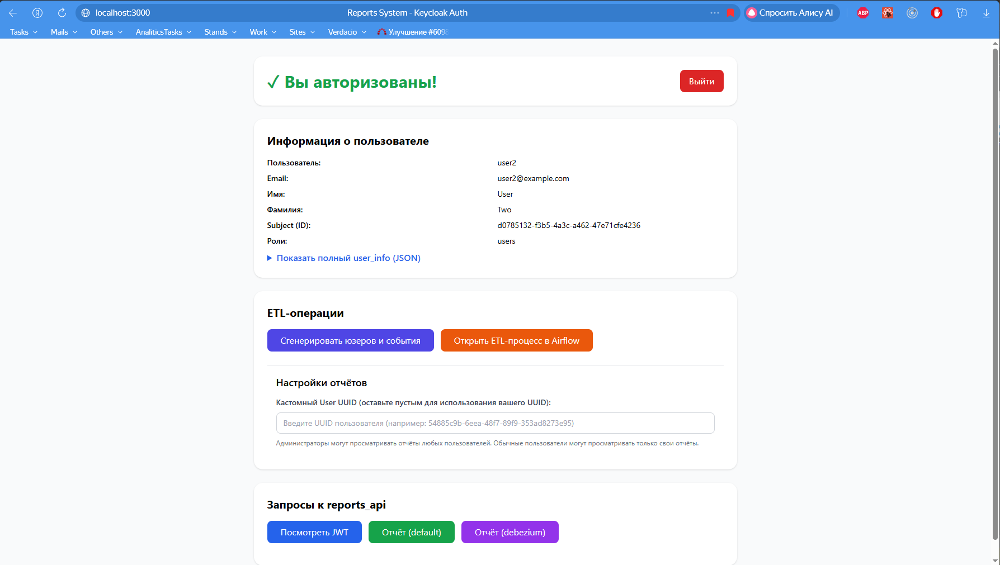
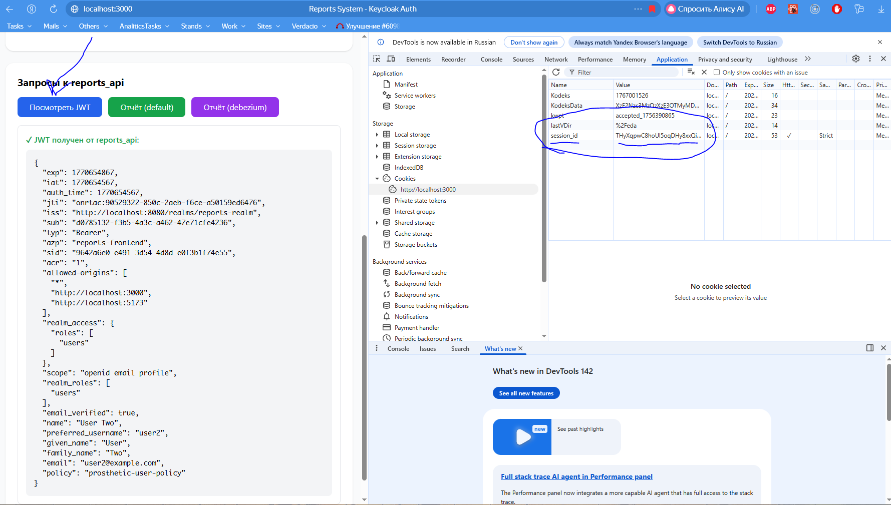
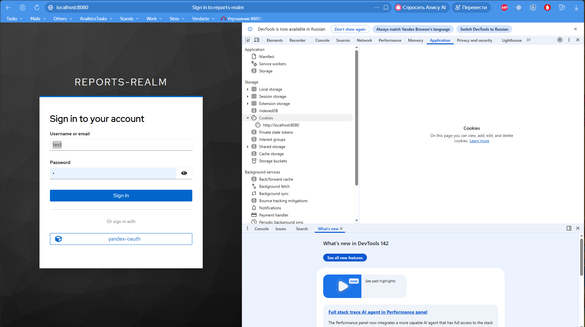

# Задание 1. Повышение безопасности системы

## Задача 1. Архитектурное решение и доработка диаграммы C4 для управления учётными данными пользователя

### Проблема

Хакерские атаки уже были и предполагается, что в дальнейшем они тоже будут по причине конкуренции.

### План действий
* перевести систему на PKCE;
* Исключить хранение IDP-токены на фронтэнде (особенно Refresh Token);  
* реализовать ротацию сессий (т.е. изменение ключа сессии после каждого запроса).

### Контекст

* Отправка телеметрии самые нагруженные методы, остальные имеют умеренную нагрузку.
* Telemetry API содержит все публичные ключи протезов, которые могут отправлять данные.
* Telemetry API содержит провки всех публичные ключи протезов.
* Необходимо обеспечит хорошую безопасность для чувствительных медицинских данных.

### Решение

Разработать аутентифицирующее прокси [`auth_proxy`](../auth_proxy).

* Доступ фронтэндам CRM, интернет-магазина и мобильному приложению протеза для взаимодействия со своими API.
* Инкапсулирование работы с Keycloak и возвращает наружу только одну куки: `session_id`, которую будет менять после каждого обращения пользователя к `auth_proxy`.
* Прокси разработан на Python с использованием FastAPI и authlib (для ускорения разработки).
* Данные сессий хранятся в Redis.
* Прокси разработан, как stateless, для облегчения горизонтально масштабироваться (т.к. данные сессий храним в Redis).
* Если будет нужна производительность – применим горизонтальное масштабирование (переписывать, например, на Go).
* Доработки в настройках `keycloak`:
  * переход на S256 PKCE Flow;
  * внешний LDAP + кастомные мапперы ролей (пароли хранятся на стороне LDAP);
  * внешний сервис Yandex OAuth 2.0;
  * подключение к Google Authenticator Service для MFA.

_Диаграмма контейнеров_ - [BionicPRO_C4_model](BionicPRO_C4_model.drawio)


### Обоснование

Почему Python (FastAPI)? 
* Скорость разработки (важно решение "as is", так как критична безопасность, произодительность не так критична, протезы обрабатываются отдельно)
* Удобстро отладки
* Готовые библиотеки

Причины полноценного прокси
* Необходимость ротирования сессий при каждом обращении (основная логика должна отрабатывать при каждом обращении любого фронтэнда к любому upstream-сервису)
* Оснавная нагрузка будет не от передачи больших объемов данных, а сам процесс ротирования сессий

### Рассмотренные альтернативы

#### Authentik

* Есть интеграция с Java Spring Boot
* Отлично подходит для простых настроек (KeyClock имеет больше подходит для отраслевой настройки)
* Мало вариативности настроек, упор на быстрое развертываение (KeyClock имеет поддержка многих протоколов, хоть и сложнее в настройке, но имеет более тонкую настройку)

#### Oauth2-proxy

* Хорошие возможности, но нет эффективной настройки ротации сессий, при каждом обращении
* Много доработок при развитии системы
* Простота решения - "прямо сейчас"

#### Использовать готовый прокси-сервис (nginx / traefik) с поддержкой forward auth

* Простота использования, готовое решение
* Сложная кастомизация решения для бизнеса
* Мало библиотек для разных сценариев использования

## Задача 2. Улучшить безопасность существующего приложения, заменив Code Grant на PKCE

В [`keycloak/realm-export.json`](../keycloak/realm-export.json) сейчас включено S256 PKCE:

```
"pkce.code.challenge.method": "S256",  
"oauth2.device.authorization.grant.enabled": "false",  
"oidc.ciba.grant.enabled": "false"  
```

```
"pkceEnabled": "true",  
"pkceMethod": "S256",  
```

Авторизующее прокси доработали соответственно (см. [`auth_proxy/keycloak_client.py`](../auth_proxy/keycloak_client.py)).

## Задача 3. Обеспечьте безопасное получение и хранение access-и refresh-токенов

Разработан сервис [`auth_proxy`](../auth_proxy):
- Через эндпоинт `/proxy` обеспечивается проксирование HTTP-обращений от клиентской части к остальным микросервисам BionicPro, добавляя JWT-токен c информацией о пользователе и его ролях (берётся из `keycloak`);
- Выставляет пользователю куки `session_id` (HttpOnly с SameSite);
- `auth_proxy` обеспечивает обмен данными с `keycloak`:
  - refresh token хранится на стороне сервиса `auth_proxy`, для хранения используется redis, refresh token хранится зашифрованным даже в redis;  
  - куки `idp_refresh_token` на клиенте не хранится;
  - используется S256 PKCE;
- `auth_proxy` делает ротацию `session_id` (меняем куки `session_id` при каждом запросе на `/proxy`);
  - поддерживаем поведение "только одна активная сессия": если один и тот же юзер залогинится со второго браузера, то предыдущая сессия будет инвалидирована (по крайней мере, для админов);
  - если `session_id` скопировать в другой браузер и сделать под ней хотя бы один запрос к `/proxy`, то сессия в первом браузере тоже будет инвалидирована, а юзеру покажут сообщение, что сессия невалидна и надо обратить внимание на безопасность (по крайней мере, для админов).

Основные поля JWT:

- `sub`: UUID пользователя в `keycloak`
- `external_uuid`: UUID пользователя в LDAP (если пользователь не из LDAP – не выставляется)
- `realm_roles`: список ролей пользователя (нам важны роли `prosthetic_users` либо `administrators`)

Проверка JWT и авторизация пользователя на доступ к конкретным ресурсам (например, к отчётам по своему и чужому `user_uuid`) – делается уже в конкретных микросервисах, для гибкости.

### Как протестировать ротацию сессий?
```bash
docker compose up -d
```

Заходим на http://localhost:3000, логинимся под каким-нибудь аккаунтом, например, под `user2` с паролем `password123`, должнен открыться отладочный фронтэнд такого вида:

_Отладочный фронтэнд_

Открываем "Инструменты разработчика" Chrome, заходим в `Application --> Cookies --> session_id`. Пощёлкаем на кнопку "Посмотреть JWT" на нашем фронтэнде, убеждаемся, что `session_id` меняется при каждом вызове (это мы проксируем отладочный метод `reports_api` для просмотра JWT, так что session_id будет меняться).

_session_id должно меняться при каждом обращении к reports_api_

Потом удалим это cookie -- перезагрузим страницу. Нас должны моментально перенаправить на страницу входа keycloak:

_После удаления session_id нас должны перенаправить перелогиниваться_

## Задача 4. Добавьте LDAP для возможности получения данных о пользователях представительства BionicPRO в другой стране

1) В [`docker-compose.yaml`](../docker-compose.yaml) была добавлена секция `openldap-china`, она символизирует LDAP-сервер в другой стране.

2) Конкретные настройки пользователей LDAP, включая их пароли, живут в [`ldap/01-init-roles.ldif`](../ldap/01-init-roles.ldif), там мы задаём нескольких пользователей:

* `customer1` (пароль `customer1_password`)  
* `customer2` (пароль `customer2_password`)  
* `customer3` (пароль `customer3_password`)

3) В [`keycloak/realm-export.json`](../keycloak/realm-export.json) добавлена секция   
```json
"components": {  
 "org.keycloak.storage.UserStorageProvider"  
...
```

В этой секции были указаны настройки LDAP и добавлены Role Mapping: в частности, LDAP-роль `customers` конвертируется в `keycloak`-роль `prosthetic_users`.

Чтобы протестировать – зайдём под юзером `customer1` и паролем `customer1_password`:

_Заходим под customer1_


_Зашли!_

## Задача 5. Настройте MFA

Настройки `keycloak` со включенным MFA для всех существующих и новых пользователей я положил в [`keycloak/realm-export-mfa.json`](../keycloak/realm-export-mfa.json) и [`keycloak/realm-export.json`](../keycloak/realm-export.json).

Настройки `keycloak` с отключенным MFA живёт в [`keycloak/realm-export-no-mfa.json`](../keycloak/realm-export-no-mfa.json)

Тестировал с Google Authenticator – вроде работало \= )


_При первом входе пользователя (пользователь `prosthetic1`, пароль `prosthetic123`)_ 


_При повторном входе пользователя (тот же пользователь)_  


_Отладочный фронтэнд открывается, показывает, что нас пустили_

## Задача 6. Добавьте OAuth 2.0 от Яндекс ID.

Здесь я сходил в [https://oauth.yandex.ru/](https://oauth.yandex.ru/) и создал там приложение: `bionicpro`


Далее – добавил Identity Provider Oauth 2.0 в `keycloak` (`keycloak` пришлось обновить до 26.4):  
```  
"identityProviders":
 {  
   "alias": "yandex-oauth",  
   "providerId": "oauth2",  
...  
```


_Кнопка yandex-oauth появилась_


_Вроде работает..._

Предупреждение, что приложение получит доступ к таким-то данным аккаунта, мне показали, но это показывается только в первый раз, а яндекс-аккаунтов у меня всего два. Если критично, чтобы были скрины предупреждения – то дайте знать, пересоздам приложение в [oauth.yandex.ru](http://oauth.yandex.ru) и пересниму скрины ))