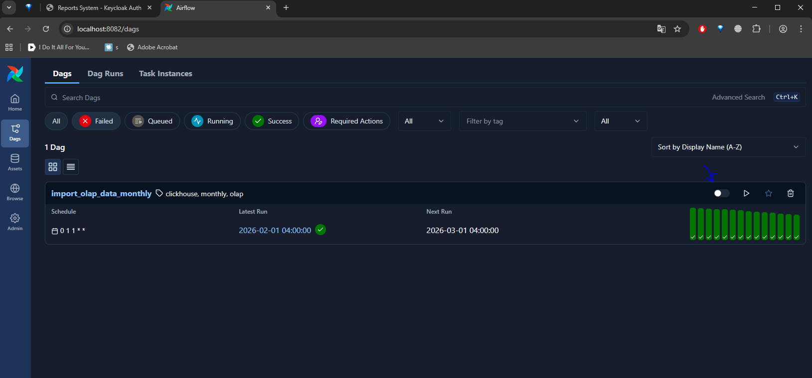
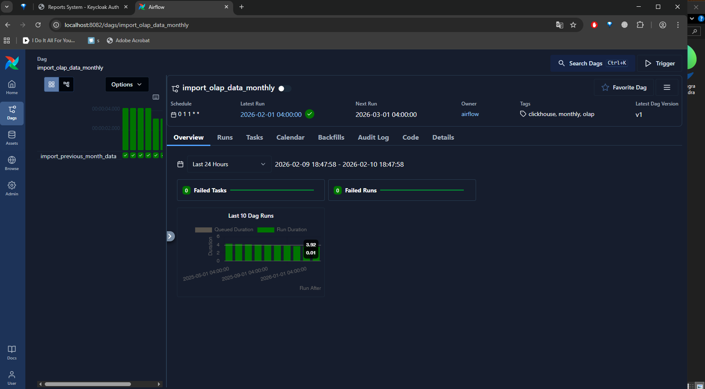
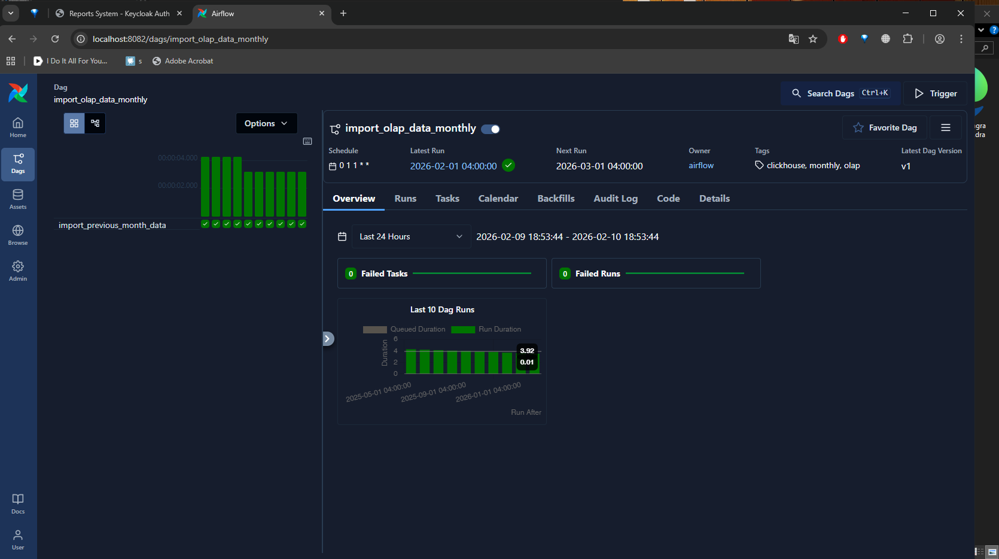
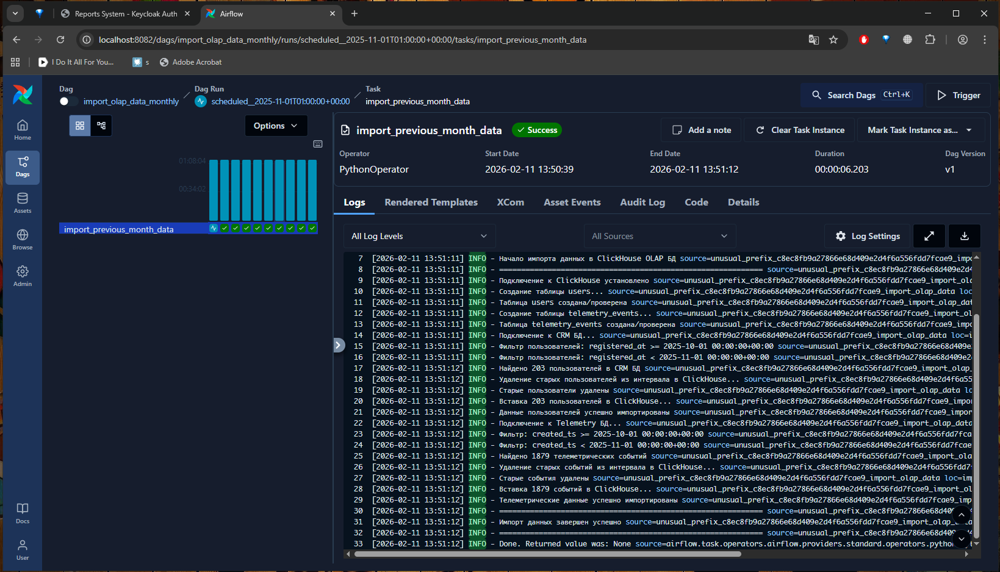
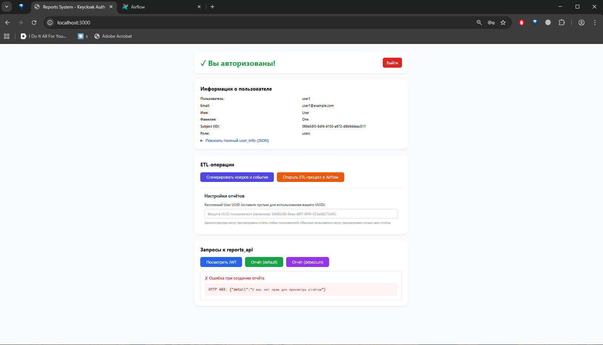
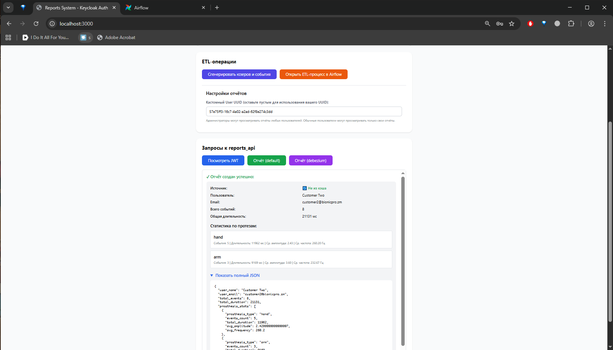
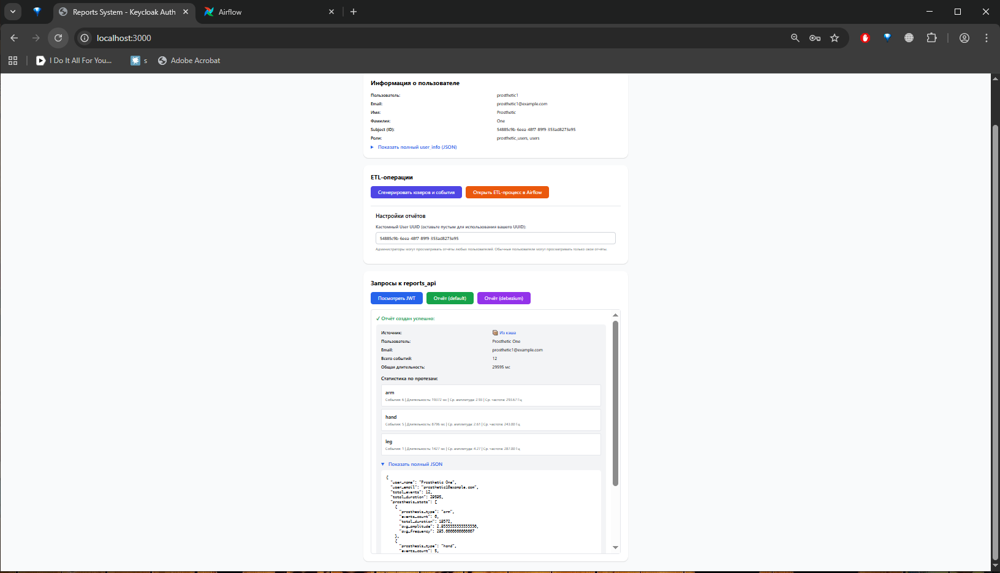

# Задание 2. Разработка сервиса отчётов

## Задача 1. Создать архитектуру решения для подготовки и получения отчётов

Технологии и решения:

- ClickHouse в качестве OLAP-базы;
- ETL-процесс на `airflow` для переноса данных из CRM DB и Telemetry DB в OLAP-базу;
- отдельный микросервис `reports_api` для построения отчётов.

[BionicPRO_C4_model.drawio](BionicPRO_C4_model.drawio) - _Диаграмма контейнеров с добавлением Reports API, OLAP-базы и ETL-процесса (жёлтым выделены новые системы нашей разработки, серым -- системы сторонних производителей, которые мы только разворачиваем)_

Описание нашего прототипа будет ниже.

### Прототип CRM API

В бэкэнде CRM, возможно, генерировались бы данные:

* о сотрудниках;  
* о позициях, доступных к заказу;  
* о пациентах,  
* о том, какие протезы у них установлены,  
* о том, какие договоры на них заключены (на протезы, на расширенную гарантию, на постгарантийное обслуживание и ремонт),  
* о всех примерках,  
* о платежах;  
* о любых обращениях в техническую поддержку – и т.д.

Для нашей задачи хватит одной таблицы `users` с информацией о пользователях.

У нас будет сервис-болванка [`crm_api`](../crm_api), написанный на FastAPI и расположенный в директории [`crm_api`](../crm_api). У него есть 2 эндпоинта:

* `/populate_base` (заполнить свою тестовую Postgres-базу из файла [`crm.csv`](../crm_api/crm.csv)), первые несколько юзеров будут юзеры `prosthetic1`, `prosthetic2`, `customer1`, `customer2`, `customer3` (`user_uuid` взяты либо те же, что стоят в [`realm-export.json`](../keycloak/realm-export.json), либо те же, что стоят в настройках LDAP для этих юзеров)
* `/register`: зарегистрировать одного пользователя с заданными настройками (используется только для автотестов).

Проверка JWT будет только в `reports_api`.

### Прототип Telemetry API

В бэкэнде телеметрии, возможно, генерировались бы разнообразные данные по телеметрии, но нам для нашей задачи тоже хватит одной таблицы `telemetry_events` с "данными о сигналах", полученных от протезов.

Для этого будет один "сервис-болванка" [`telemetry_api`](../telemetry_api), написанный на FastAPI и расположенный в директории [`telemetry_api`](../telemetry_api). У сервиса 2 эндпоинта:

* `/populate_base`: заполнить событиями тестовую Postgres-базу телеметрии;
* `/telemetry`: добавить одно или несколько телеметрических событий (используется только в автотестах).

Проверка JWT будет только в `reports_api`.

### Прототип OLAP-базы на ClickHouse

В боевой системе оно могло бы развёртываться в Kubernetes из Helm Chart, и там было бы применено шардирование, репликация, но в нашем случае, просто развернём одну ноду в Docker Compose (см. секцию `olap-db`).

БД ClickHouse будет развёрнута по адресу `localhost:8123`, юзер `default`, пароль `clickhouse_password`

Наш ETL-процесс будет заливать данные в схему `default` (схема `debezium` появится позже).

#### Схема default

В этой схеме у нас две таблицы:

- `users` (Join Table Engine):
  - его мы храним в памяти для более быстрых JOINов, так как данных по юзерам заведомо немного;
  - уникальность по `user_uuid` должна обеспечиваться автоматически.
- `telemetry_events` (`ReplacingMergeTree`):
  - партиционирование по месяцам + `ORDER BY (user_uuid, …)` с `user_uuid` первым пунктом для возможности быстрого поиска по месяцам и юзерам;
  - выбираем именно `ReplacingMergeTree`, чтобы обеспечить уникальность событий на случай повторного чтения из `kafka` (при развитии системы это может пригодиться).

```clickhouse
create table users  
(  
    user_id           Int32,  
    user_uuid         String,  
    name              String,  
    email             String,  
    age               Nullable(Int32),  
    gender            Nullable(String),  
    country           Nullable(String),  
    address           Nullable(String),  
    phone             Nullable(String),  
    registered_at     DateTime,  
    registration_date Date default toDate(registered_at)  
)  
    engine = Join(ANY, LEFT, user_uuid);
```
```clickhouse
create table telemetry_events  
(  
    id               Int64,  
    event_uuid       String,  
    user_uuid        String,  
    prosthesis_type  String,  
    muscle_group     String,  
    signal_frequency Int32,  
    signal_duration  Int32,  
    signal_amplitude Float64,  
    created_ts       DateTime,  
    saved_ts         DateTime  
)  
    engine \= ReplacingMergeTree(saved_ts)  
        PARTITION BY (toYear(created_ts), toMonth(created_ts))  
        ORDER BY (user_uuid, event_uuid, created_ts)  
        SETTINGS index_granularity = 8192;
```

### Прототип airflow

В боевой системе у нас было бы `airflow` на Kubernetes, развёрнутое из Helm Chart и использующее `KubernetesExecutor`.

Для нашего прототипа развернём в нашем [`docker-compose`](../docker-compose.yaml) отладочную конфигурацию `airflow` standalone, причём с отключенной аутентификацией, для простоты.

Описание DAGа с ETL-процессом переноса данных – ниже.

## Задача 2. Разработать Airflow DAG и настроить его на запуск по расписанию

`airflow`-DAG лежит в [airflow/dags/import_olap_data.py](../airflow/dags/import_olap_data.py)

Там предусмотрен запуск ETL-процесса по расписанию (1 раз в месяц).
Выставлен параметр `catchup=True` для запуска за предыдущие месяцы при активации DAGа.

Чтобы проверить – действуем следующим образом.


_1) Заходим в отладочный фронтэнд ([http://localhost:3000](http://localhost:3000)) и логинимся под любым пользователем с ролью `prosthetic_users` (нужно именно с этой ролью, т.к. ETL-процесс запускать может кто угодно, а вот смотреть отчёт может уже не кто угодно). Годится, например, юзер `prosthetic1` с паролем `prosthetic123`_

_2) Нажимаем кнопку “Сгенерировать юзеров и события”, ждём пока нам покажут, что сгенерировано 1000 юзеров и 10000 событий._

_3) Нажимаем кнопку "Открыть ETL-процесс в Airflow", откроется страница DAGа в `airflow`_


_4) Активируем DAG_


_5) Заходим внутрь DAGа: [http://localhost:8082/dags/import_olap_data_monthly/runs/scheduled__2025-04-01T01:00:00+00:00/tasks/import_previous_month_data](http://localhost:8082/dags/import_olap_data_monthly/runs/scheduled__2025-04-01T01:00:00+00:00/tasks/import_previous_month_data)_


_6) Смотрим запуски за предыдущие месяцы, должно быть примерно так_



_События у нас генерились с февраля по март, так что выбираем [период за март 2025](http://localhost:8082/dags/import_olap_data_monthly/runs/scheduled__2025-04-01T01:00:00+00:00/tasks/import_previous_month_data)_

_Должно быть примерно такое, как на предыдущем слайде (т.е. видны найденные юзеры и события)_


_Потом возвращаемся в [http://localhost:3000](http://localhost:3000) и жмём кнопку "Отчёт (default)", должны показать вот такой отчёт из [`reports_api`](../reports_api) (по запросу из `olap-db`, из схемы `default`)_

На всякий случай – можно ещё и подключиться к ClickHouse каким-нибудь клиентом и посмотреть, что данные в схеме `default` точно появились.

## Задача 3. Создать бэкенд-часть приложения для Reports API

Приложение [`reports_api`](../reports_api) запускается через `docker compose` (см. секцию `reports-api` в [`docker-compose.yaml`](../docker-compose.yaml)), исходники находятся в [`reports_api/`](../reports_api)

Приложение написано на FastAPI, у него 2 основных эндпоинта:

- `/jwt`: вывести содержимое JWT-токена, который выставлен на [`auth_proxy`](../auth_proxy) (нужно для отладки и тестирования);
- `/reports`: метод генерации отчёта.
  - Этот метод принимает на вход:
    - JWT с информацией о пользователе (`user_uuid`, `external_uuid`, роли юзера);
    - информацию о том, за какой период сгенерировать отчёт;
    - `[только для роли administrators]` UUID пользователя, по которому сгенерировать отчёт (если по другому пользователю, а не для себя).

Хинт: Фронтэнд делает так, что отчёт мы всегда заказываем за период с начала времён – по 00:00 1 числа текущего месяца (считаем, что ETL-процесс всё равно отрабатывает раз в месяц).

При вызове эндпоинта `/reports` приложение проверяет JWT-токен по публичному ключу нашего `keycloak`, проверяет роли пользователя, его UUID – и после этого подключается к `olap-db`, делает запрос – и генерирует по нему отчёт:

- сколько всего событий;
- общая длительность событий;
- статистика по отдельным протезам:
  - число событий по протезу;
  - общая длительность сигналов;
  - средняя амплитуда сигналов;
  - средняя частота сигналов.

## Задача 4 и. Ограничение доступа к эндпоинту отчётности

Это сделано. Чтобы протестировать:

* возвращаемся в [http://localhost:3000](http://localhost:3000)  
* жмём кнопку “Выйти”  
* заходим под другим юзером, например, user1 с паролем password123  
* жмём кнопку “Отчёт (default)”, должны показать сообщение об ошибке:


_Сообщение об ошибке при попытке просмотра любого отчёта, если вы не имеете ролей `prosthetic_users` или `administrators`_

И просмотр чужих отчётов:

* заходим под юзером admin1 с паролем admin123  
* В поле “Кастомный User UUID” вводим `7f7861be-8810-4c0c-bdd0-893b6a91aec5` (UUID от `prosthetic2`)  
* Жмём кнопку “Отчёт (default)” – и видим этот отчёт.


_Админы могут смотреть чужие отчёты_

* Потом заходим под юзером prosthetic1 с паролем prosthetic123 и вводим в поле “Кастомный User UUID” то же самое значение `7f7861be-8810-4c0c-bdd0-893b6a91aec5  `
* Жмём кнопку “Отчёт (default)” или “Отчёт (debezium)”, видим ошибку: `HTTP 403: {"detail":"У вас нет прав для просмотра отчёта другого пользователя"}`


_`prosthetic_users` могут смотреть только свои отчёты_

Если убрать UUID из этого поля, то свой отчёт вы должны посмотреть успешно.

## Задача 5. Добавить в UI кнопку получения отчёта и вызова эндпоинта его генерации
`[Generated with Claude Sonnet 4.5]`

Кнопки генерации отчётов реализованы в [`bionicpro_frontend/src/App.tsx`](../bionicpro_frontend/src/App.tsx):

### Кнопки отчётов (строки 637-651)
```typescript
<button
  onClick={() => generateReport('default')}
  disabled={loadingReport}
  className="bg-green-600 text-white py-2 px-6 rounded-lg hover:bg-green-700 transition disabled:bg-gray-400 disabled:cursor-not-allowed"
>
  {loadingReport ? 'Загрузка...' : 'Отчёт (default)'}
</button>

<button
  onClick={() => generateReport('debezium')}
  disabled={loadingReport}
  className="bg-purple-600 text-white py-2 px-6 rounded-lg hover:bg-purple-700 transition disabled:bg-gray-400 disabled:cursor-not-allowed"
>
  {loadingReport ? 'Загрузка...' : 'Отчёт (debezium)'}
</button>
```

### Функция генерации отчёта (строки 312-436)
Функция `generateReport(schema: 'default' | 'debezium')` выполняет:
1. Вычисляет `end_ts` (00:00 1-го числа текущего месяца по UTC)
2. Определяет `user_uuid` (приоритет: `customUserUuid` → `external_uuid` → `sub`)
3. Проверяет наличие отчёта в MinIO-кэше через [`minio-nginx`](../minio_nginx)
4. Если отчёт в кэше — загружает его (помечает `from_cache: true`)
5. Если отчёта нет — генерирует новый через [`reports_api/reports`](../reports_api) (помечает `from_cache: false`)
6. Отображает результат в блоке с прокруткой (строки 678-733)

### Поле для кастомного UUID (строки 600-620)
Позволяет администраторам указать UUID другого пользователя для просмотра его отчёта:
```typescript
<input
  id="customUserUuid"
  type="text"
  value={customUserUuid}
  onChange={(e) => setCustomUserUuid(e.target.value)}
  placeholder="Введите UUID пользователя"
  className="px-3 py-2 border border-gray-300 rounded-lg..."
/>
```

Обычные пользователи (`prosthetic_users`) могут просматривать только свои отчёты, администраторы — любые.