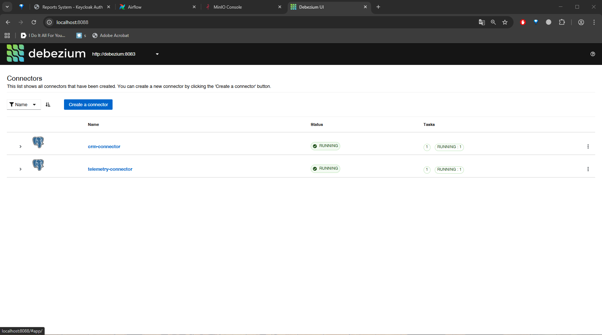
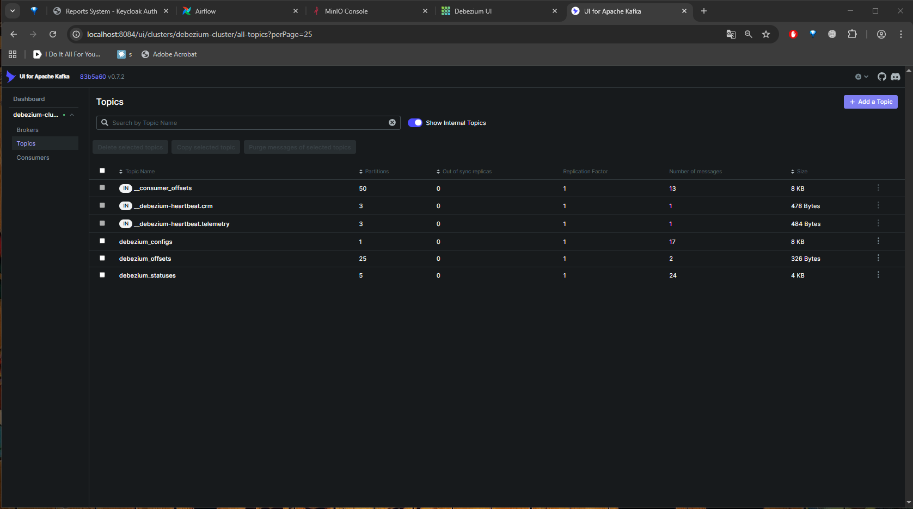
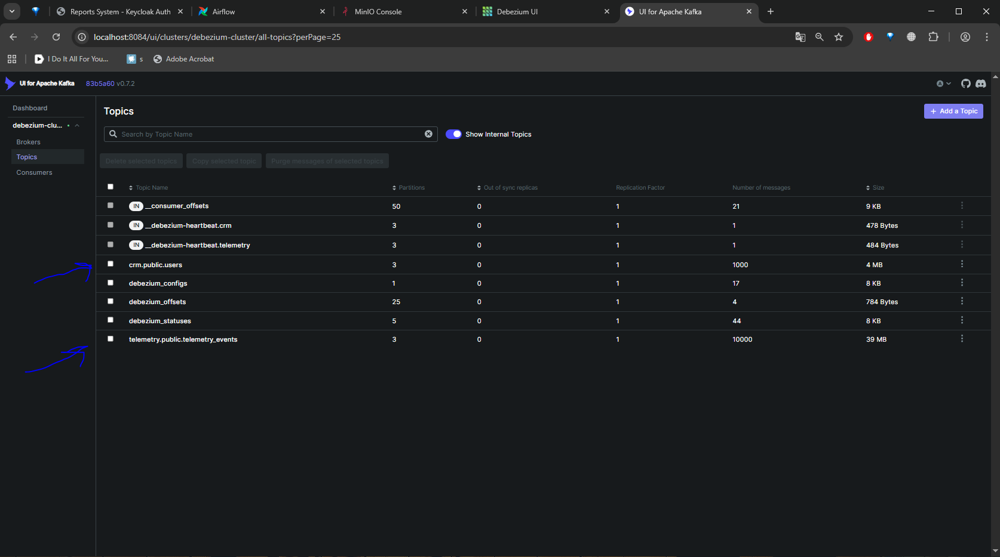
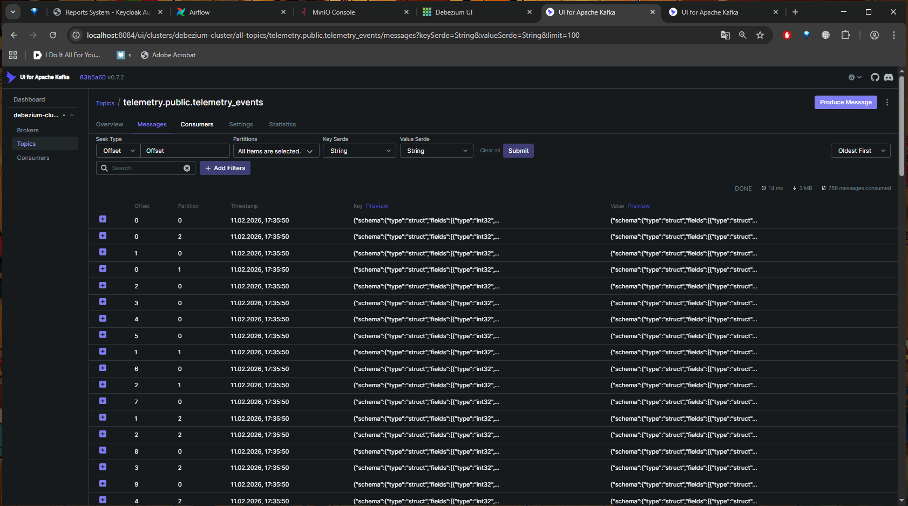
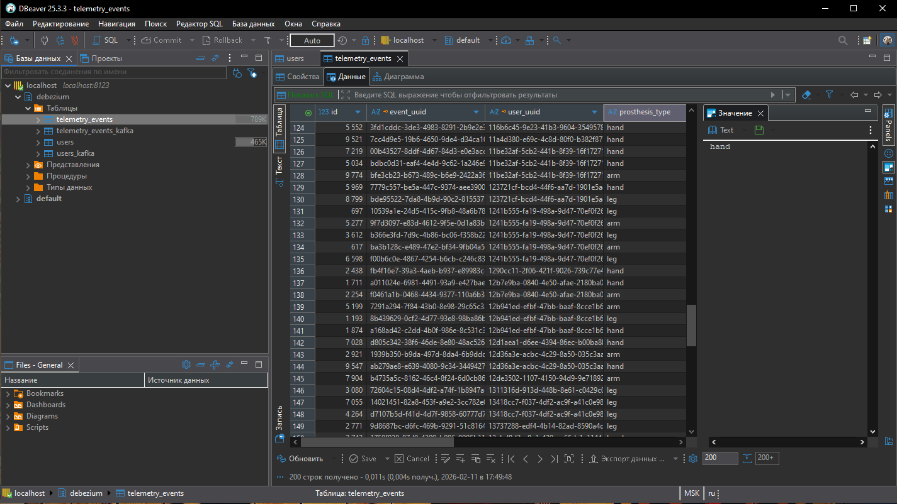
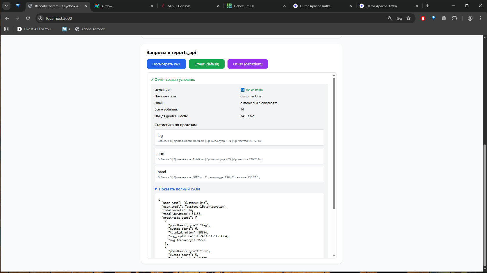

# Задание 4. Повышение оперативности и стабильности работы CRM

## Kafka + Kafka Connect + Debezium как средство переноса данных

Для переноса данных на лету мы воспользуемся `kafka` + `debezium`:

- это должно "размазать" профиль нагрузки на CRM DB и Telemetry DB (запуск тяжёлых ETL-процессов по расписанию может перегружать базу);
- и это может помочь обновлять данные для отчётов быстрее (т.к. данные из PostgreSQL будут попадать в ClickHouse в течение нескольких секунд/минут).

В боевой системе у нас было бы развёртывание `kafka` и `debezium` из стандартных helm-ов на Kubernetes, но для нашей задачи мы просто развернём `kafka` + `kafka-connect` + `debezium` в нашем [docker-compose](../docker-compose.yaml).

## Настройки PostgreSQL

Для начала – сделаем правки в настройках PostgreSQL:
```ini
wal_level = logical
max_replication_slots = 10
max_wal_senders = 10
```
И создадим юзера и публикацию для `debezium`:
```sql
CREATE USER debezium_user WITH PASSWORD 'debezium_password' REPLICATION;
GRANT CONNECT ON DATABASE crm_db TO debezium_user;
GRANT USAGE ON SCHEMA public TO debezium_user;
GRANT SELECT ON ALL TABLES IN SCHEMA public TO debezium_user;
ALTER DEFAULT PRIVILEGES IN SCHEMA public GRANT SELECT ON TABLES TO debezium_user;
CREATE PUBLICATION crm_debezium_publication FOR ALL TABLES;
```

Подробно – см. настройки:
* [`crm_db/init.sql`](../crm_db/init.sql)
* [`crm_db/postgresql.conf`](../crm_db/postgresql.conf)
* [`telemetry_db/init.sql`](../telemetry_db/init.sql)
* [`telemetry_db/postgresql.conf`](../telemetry_db/postgresql.conf)

## Настройки самого Debezium

В боевой системе, наверно, сериализация была бы во что-то быстрое и ёмкое, вроде Protobuf, и без приложения схемы к сообщениям.

У нас для упрощения используется простой крестьянский JSON, да ещё и с приложением схемы прямо в сообщения. Это делалось чисто для удобства отладки и тестирования, так как нормально пользоваться `debezium` я дотоле не умел, а сроки и так провалены полностью, то способ сериализации я выставлял самый крестьянский: в виде JSON. Конфиги большей частью сгенерировал через Claude Sonnet, чуть-чуть доработал руками, тесты проходят – и слава богу.

Самое главное – что мы выставили `snapshot.mode` = `initial`.

Конкретные настройки коннекторов – см. [`debezium/crm-connector-config.json`](../debezium/crm-connector-config.json) и [`debezium/telemetry-connector-config.json`](../debezium/telemetry-connector-config.json).

## Настройки ClickHouse

Мы внесли небольшие правки в конфиги ClickHouse (чтобы начинать вычитывать данные из `kafka`-топика с самого начала, чтобы `olap-db` могла стартовать позже `debezium`):
```xml
<clickhouse>
   <kafka>
       <!-- Глобальная настройка для всех Kafka-таблиц -->
       <auto_offset_reset>earliest</auto_offset_reset>
   </kafka>
</clickhouse>
```

Конфигурация: [`clickhouse_config/kafka_settings.xml`](../clickhouse_config/kafka_settings.xml)

### Схема debezium

И у нас добавляется новая схема `debezium`.
Здесь мы делаем традиционную для ClickHouse связку: Kafka Table Engine → Materialized View → обычные таблицы.

К таблицам `users` и `telemetry_events`, которые такие же, как и в схеме `default`, добавятся:

* `users_kafka`
* `telemetry_events_kafka`
* `users_mv`
* `telemetry_events_mv`

И наш [`reports_api`](../reports_api) теперь при старте создаёт новые сущности:
* `debezium.users`
* `debezium.telemetry_events`
* `debezium.users_kafka`
* `debezium.telemetry_events_kafka`
* `debezium.users_mv`
* `debezium.telemetry_events_mv`

Реализация: [`reports_api/main.py`](../reports_api/main.py) (функция `init_debezium_schema`)

Примеры DDL – ниже.

```sql
CREATE TABLE users_kafka
(
    payload String
)
ENGINE = Kafka
SETTINGS
    kafka_broker_list = 'kafka:9093',
    kafka_topic_list = 'crm.public.users',
    kafka_group_name = 'clickhouse_crm_consumer',
    kafka_format = 'JSONAsString',
    kafka_num_consumers = 1,
    kafka_thread_per_consumer = 1,
    kafka_skip_broken_messages = 1000,
    kafka_max_block_size = 1048576;
```

```sql
CREATE TABLE telemetry_events_kafka
(
    payload String
)
ENGINE = Kafka
SETTINGS
    kafka_broker_list = 'kafka:9093',
    kafka_topic_list = 'telemetry.public.telemetry_events',
    kafka_group_name = 'clickhouse_telemetry_consumer',
    kafka_format = 'JSONAsString',
    kafka_num_consumers = 1,
    kafka_thread_per_consumer = 1,
    kafka_skip_broken_messages = 1000,
    kafka_max_block_size = 1048576;
```

```sql

CREATE MATERIALIZED VIEW debezium. users_mv  
            TO debezium. users  
            (  
             `user_id` Int64,  
             `user_uuid` String,  
             `name` String,  
             `email` String,  
             `age` Int64,  
             `gender` String,  
             `country` String,  
             `address` String,  
             `phone` String,  
             `registered_at` DateTime64(6)  
                )  
AS  
SELECT JSONExtractInt(JSONExtractString(JSONExtractString(payload, 'payload'), 'after'), 'id')           AS user_id,  
       JSONExtractString(JSONExtractString(JSONExtractString(payload, 'payload'), 'after'), 'user_uuid') AS user_uuid,  
       JSONExtractString(JSONExtractString(JSONExtractString(payload, 'payload'), 'after'), 'name')      AS name,  
       JSONExtractString(JSONExtractString(JSONExtractString(payload, 'payload'), 'after'), 'email')     AS email,  
       JSONExtractInt(JSONExtractString(JSONExtractString(payload, 'payload'), 'after'), 'age')          AS age,  
       JSONExtractString(JSONExtractString(JSONExtractString(payload, 'payload'), 'after'), 'gender')    AS gender,  
       JSONExtractString(JSONExtractString(JSONExtractString(payload, 'payload'), 'after'), 'country')   AS country,  
       JSONExtractString(JSONExtractString(JSONExtractString(payload, 'payload'), 'after'), 'address')   AS address,  
       JSONExtractString(JSONExtractString(JSONExtractString(payload, 'payload'), 'after'), 'phone')     AS phone,  
       fromUnixTimestamp64Micro(JSONExtractUInt(JSONExtractString(JSONExtractString(payload, 'payload'), 'after'),  
                                                'registered_at'))                                        AS registered_at  
FROM debezium. users_kafka  
WHERE JSONExtractString(JSONExtractString(payload, 'payload'), 'op') IN ('c', 'u', 'r');

CREATE MATERIALIZED VIEW debezium. telemetry_events_mv  
            TO debezium. telemetry_events  
            (  
             `id` Int64,  
             `event_uuid` String,  
             `user_uuid` String,  
             `prosthesis_type` String,  
             `muscle_group` String,  
             `signal_frequency` Int64,  
             `signal_duration` Int64,  
             `signal_amplitude` Float64,  
             `created_ts` DateTime64(6),  
             `saved_ts` DateTime64(6)  
                )  
AS  
SELECT JSONExtractInt(JSONExtractString(JSONExtractString(payload, 'payload'), 'after'), 'id')                 AS id,  
       JSONExtractString(JSONExtractString(JSONExtractString(payload, 'payload'), 'after'),  
                         'event_uuid')                                                                         AS event_uuid,  
       JSONExtractString(JSONExtractString(JSONExtractString(payload, 'payload'), 'after'),  
                         'user_uuid')                                                                          AS user_uuid,  
       JSONExtractString(JSONExtractString(JSONExtractString(payload, 'payload'), 'after'),  
                         'prosthesis_type')                                                                    AS prosthesis_type,  
       JSONExtractString(JSONExtractString(JSONExtractString(payload, 'payload'), 'after'),  
                         'muscle_group')                                                                       AS muscle_group,  
       JSONExtractInt(JSONExtractString(JSONExtractString(payload, 'payload'), 'after'),  
                      'signal_frequency')                                                                      AS signal_frequency,  
       JSONExtractInt(JSONExtractString(JSONExtractString(payload, 'payload'), 'after'),  
                      'signal_duration')                                                                       AS signal_duration,  
       JSONExtractFloat(JSONExtractString(JSONExtractString(payload, 'payload'), 'after'),  
                        'signal_amplitude')                                                                    AS signal_amplitude,  
       fromUnixTimestamp64Micro(JSONExtractUInt(JSONExtractString(JSONExtractString(payload, 'payload'), 'after'),  
                                                'created_ts'))                                                 AS created_ts,  
       fromUnixTimestamp64Micro(JSONExtractUInt(JSONExtractString(JSONExtractString(payload, 'payload'), 'after'),  
                                                'saved_ts'))                                                   AS saved_ts  
FROM debezium. telemetry_events_kafka  
WHERE JSONExtractString(JSONExtractString(payload, 'payload'), 'op') IN ('c', 'u', 'r');  
```

## Доработки в Reports API

* Теперь наш [`reports_api`](../reports_api) при старте создаёт таблички не только в `default`-схеме, но и в `debezium`-схеме (и табличек этих стало побольше).
* Кроме того, теперь наш метод `/reports` принимает на вход дополнительный признак: из какой схемы доставать данные для отчёта: из `default` или из `debezium`.

Реализация: [`reports_api/main.py`](../reports_api/main.py)

## Как проверить, что Debezium работает?

```bash  
docker compose down -v  
docker compose build  
docker compose up -d  
```

### Проверим, что вначале данных нет, а коннекторы уже есть

Заходим в Debezium UI на [http://localhost:8088](http://localhost:8088) и проверяем, что коннекторы там появились.


_Коннекторы в `debezium`: они есть со старта_

Заходим в Kafka UI на [http://localhost:8084/ui/clusters/debezium-cluster/all-topics?perPage=25](http://localhost:8084/ui/clusters/debezium-cluster/all-topics?perPage=25) и проверяем, что топиков `users` или `telemetry_events` ещё нет.

_А вот `kafka`-топиков по таблицам `users` и `telemetry_events` на старте ещё нет_

Опционально – открываем наш любимый DataGrip и смотрим, что у нас в `crm_db`, `telemetry_db` и `olap_db`:

* `crm_db`: PostgreSQL-база на `localhost:5444`, база `crm_db`, схема `public`, юзер `crm_user`, пароль `crm_password` (проверяем, что таблица `users` пуста);
* `telemetry_db`: PostgreSQL-база на `localhost:5445`, база `telemetry_db`, схема `public`, юзер `telemetry_user`, пароль `telemetry_password` (проверяем, что таблица `telemetry_events` пуста);
* `olap_db`: ClickHouse-база на `localhost:8123`, юзер `default`, пароль `clickhouse_password`, схема `debezium` (проверяем, что таблицы в этой схеме создались, но пусты).

### Запустим генерацию данных

Заходим в [http://localhost:3000](http://localhost:3000) и логинимся под любым юзером, например, `customer1` с паролем `customer1_password`.

Жмём кнопку “Сгенерировать юзеров и события”. Ждём пару минут для надёжности, чтобы debezium начал отрабатывать.

### Проверим, что теперь данные экспортируются

#### Зайдём в Kafka UI



_[http://localhost:8084/ui/clusters/debezium-cluster/all-topics](http://localhost:8084/ui/clusters/debezium-cluster/all-topics) – проверим, что появились новые топики для наших таблиц ([crm.public.users](http://localhost:8084/ui/clusters/debezium-cluster/all-topics/crm.public.users) и [telemetry.public.telemetry_events](http://localhost:8084/ui/clusters/debezium-cluster/all-topics/telemetry.public.telemetry_events)). Должно быть примерно так_


_[Зайдём в один из этих топиков](http://localhost:8084/ui/clusters/debezium-cluster/all-topics/telemetry.public.telemetry_events/messages?keySerde=String&valueSerde=String&limit=100) и проверим, что сообщения в этих топиках точно появились._ 

#### Посмотрим содержимое таблиц в olap_db → debezium

_Если откроем нашу `olap_db` в DataGrip или подобном редакторе, то там должно появиться 1000 юзеров и 10000 событий_

#### Сгенерируем уже отчёт по debezium-схеме


_Заходим обратно в [http://localhost:3000](http://localhost:3000) и жмём кнопку “Отчёт (debezium)”. Отчёт должен сгенерироваться_  
